# Venom

#### Descripción

Venom es una herramienta de Pentesting e ingenieria social, fue creada con intenciones educacionales, por favor usar con discreción. No nos hacemos responsables de cualquier uso que vaya en contra de la ley.
***Es importante también aclarar que la herramienta solo funciona para el sistema operativo de Windows.***

### ¿Como funciona?

La herramienta requiere de parámetros para su correcta ejecución desde una terminal:

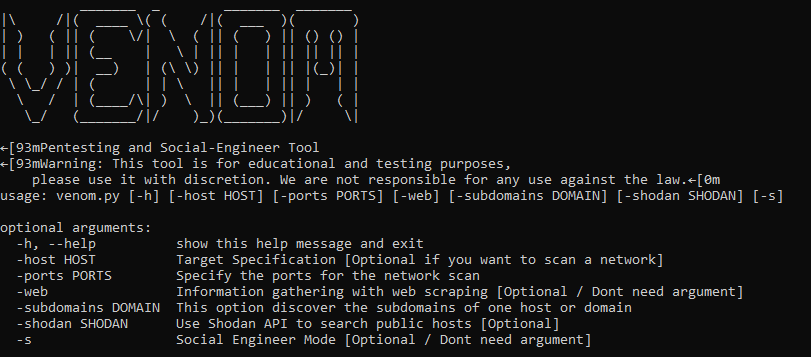

###### Ingenieria social

**La herramienta de ingeniera social ejecuta con el párametro _python venom.py -s_ y muestra un menú con 3 opciones:**

1- **Email Vector Attack**: Envia un correo a una victima desde un correo atacante, (puede ser uno personal pero recomendamos usar el creado con faker en la opción de Create a Fake ID) la parte donde se envia el correo se ve de esta forma:

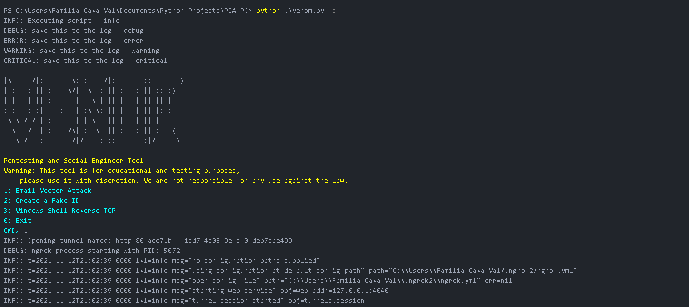

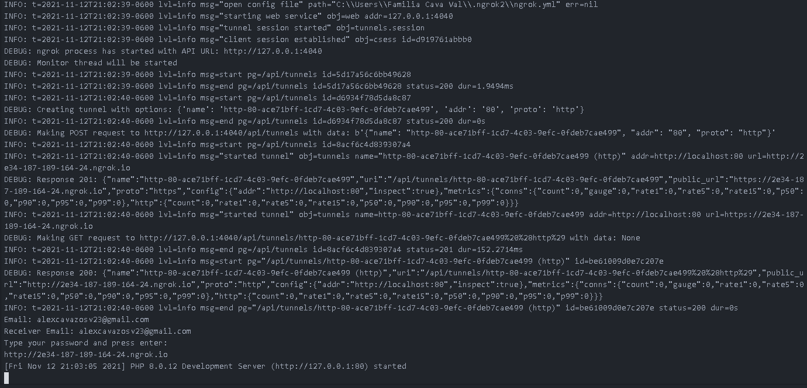

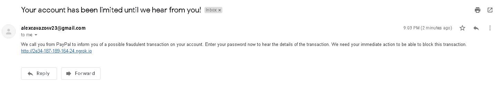

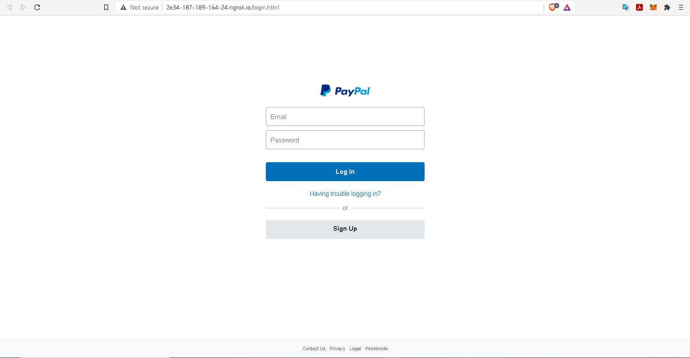

2- **Create a fake ID**: Crear una identidad falsa con el modulo faker y además un correo para dicha identidad, como se ve a continuación

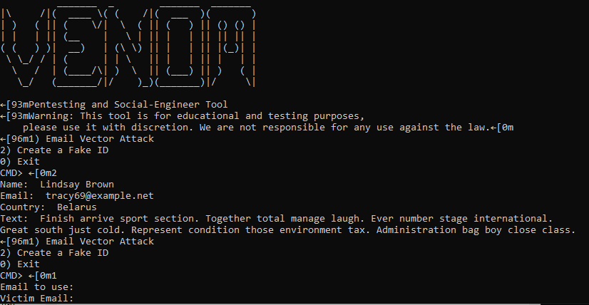

3- **Windows Shell Reverse_TCP**: Crea un archivo py que sirve para hacer una conexion TCP.
 
Se ve de esta manera:
	

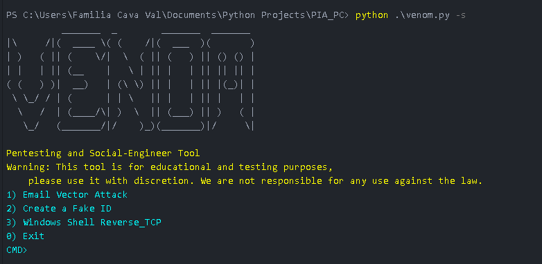
	
###### Pentesting 

**Las herramientas de pentesting son variadas y dependen del párametro**

***python venom.py -host [Objetivo] -ports [Especificación de puertos]***: Esta herramienta realiza un escaneo a un host especificado con la herramienta de nmap y se pueden seleccionar puertos en especifico, al final te genera un reporte html, su ejemplo de ejecución:

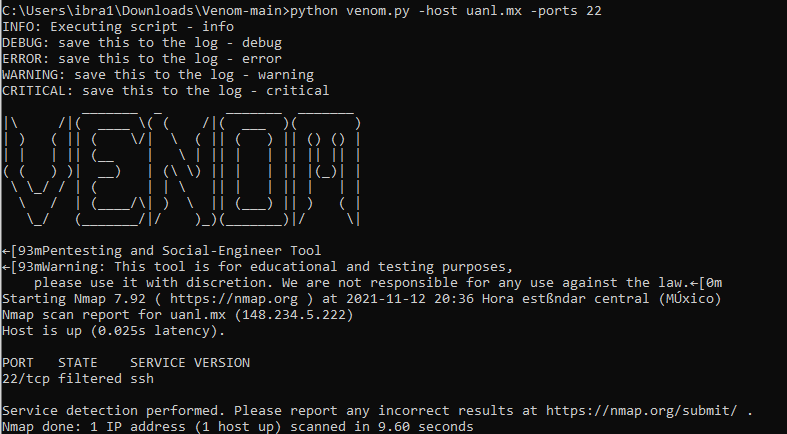
	
El reporte del escaneo nmap debe verse de la siguiente manera:
	

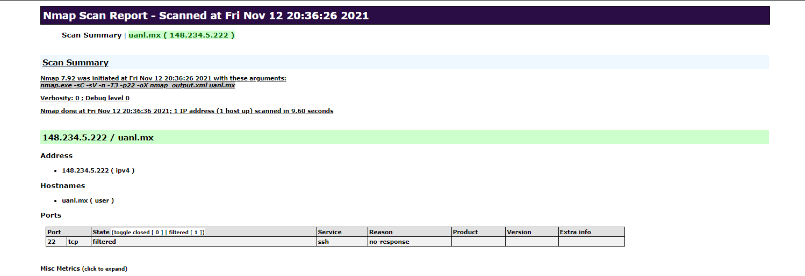
	
***python venom.py -web***: Esta opción no ocupa de un parametro y su ejecución se ve de la siguiente manera 
	

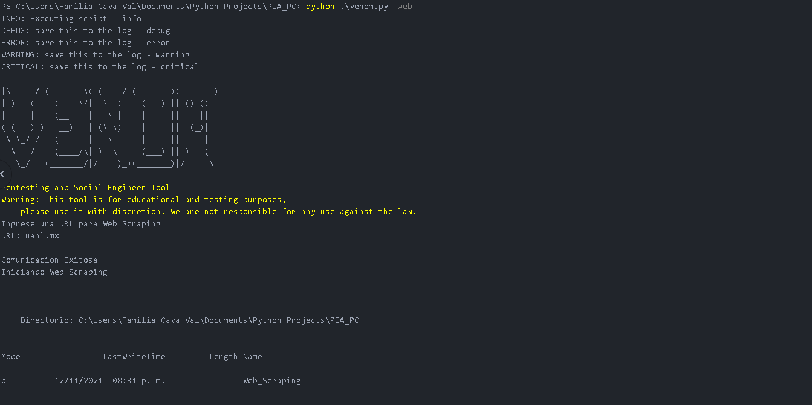

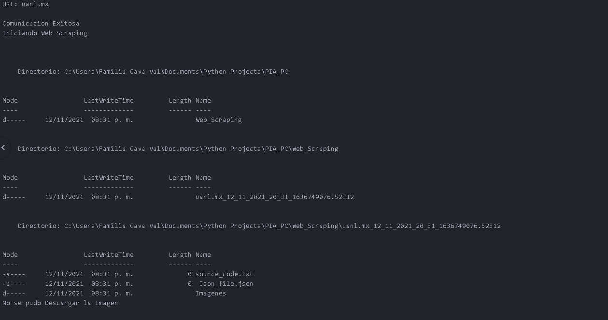

***python venom.py -subdomain [Nombre de dominio]***: Aquí se obtienen todos los subdominios de un dominio en especifico, como por ejemplo:
	

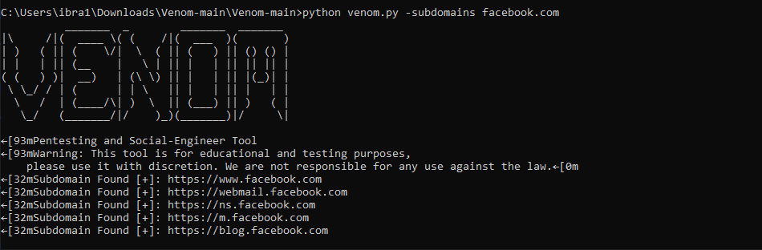
	
***python venom.py -shodan [Busqueda]***: Uso del API de shodan para realizar una busqueda en el buscador de Shodan
	

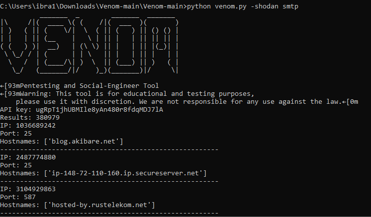

### Requisitos

Si tiene fallas con php, es recomendable tenerlo instalado en el sistema operativo 

[Descargar php](https://windows.php.net/download/).

Tener Python versión 3 en adelante

[Descargar Python](https://www.python.org/downloads/).

Si tiene falls con ngrok, es recomendable tenerlo instalado en el sistema operativo

[Descargar ngrok](https://ngrok.com/download)

